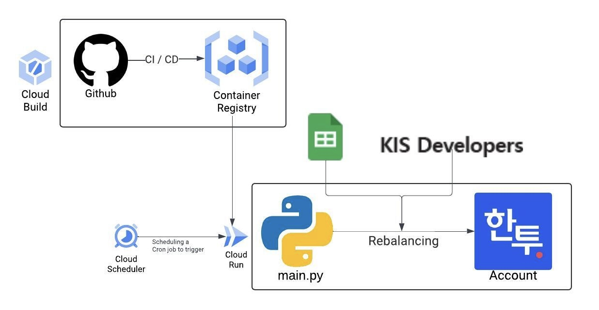

# proj-asset-allocation

## 목적
정적 자산 배분을 자동화 하기 위한 목적으로 개발되었습니다.

## 의존성
- 한국투자증권 Open API 기반
  - 국내 증권사 중에서는 macOS 환경에서 사용할 수 있는 Open API를 제공하는 곳은 `한국투자증권`이 유일한 것으로 알고 있다.
  - 키움증권 Open API는 windows 환경에서만 작동 가능한 것으로 알고 있다.
  - [한국투자증권 Open API Docs](https://apiportal.koreainvestment.com/apiservice)
- 구글 시트 기반
  - 자산 배분을 위한 레시피를 구글시트에 저장하고, 이를 활용한다.
  - 리밸런싱시 발생한 로그를 구글 시트에 기록한다.
- 의존성 패키지: poetry 기반

## 사용 예시
