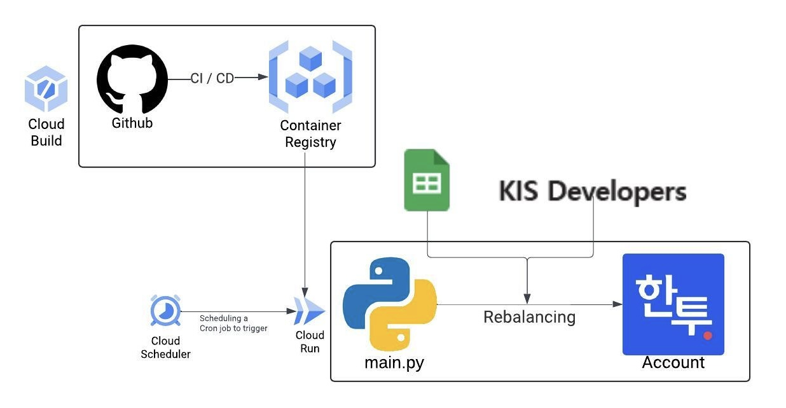

# proj-asset-allocation

정적 자산 배분 전략을 자동으로 실행하는 리밸런싱 자동화 도구입니다.
한국투자증권 Open API로 국내 ETF 주문을 실행하고, BigQuery에 거래 이력을 적재하며, Slack으로 리밸런싱 요약을 발송합니다.



모듈 구조와 데이터 흐름은 [docs/ARCHITECTURE.md](./docs/ARCHITECTURE.md)를 참고하세요.

---

## 사전 조건

실행 전 아래 항목이 준비되어 있어야 합니다.

- **한국투자증권 API 키** — App Key / App Secret / 계좌번호
- **GCP 프로젝트** — 서비스 계정 JSON (로컬 실행 시), BigQuery 데이터셋 생성 필요
- **Google Sheets** — 목표 비중 시트 (`{account_type}_allocation`) 포함한 스프레드시트
- **Slack Bot 토큰** — 결과 채널에 Bot이 초대된 상태

---

## 설정

### `.env`

```env
EXECUTE_ENV=LOCAL
KIS_API_AUTH_PATH=/path/to/kis_api_auth.json
GOOGLE_SERVICE_ACCOUNT_PATH=/path/to/gcp_service_account.json
GOOGLE_SHEET_URL=https://docs.google.com/spreadsheets/d/...
SLACK_BOT_TOKEN=xoxb-...
SLACK_CHANNEL_ID=C...
BQ_PROJECT_ID=your-gcp-project-id
BQ_DATASET_ID=asset_allocation
```

| 변수 | 설명 |
|---|---|
| `EXECUTE_ENV` | `LOCAL`이면 서비스 계정 JSON 사용, 그 외 ADC 사용 |
| `KIS_API_AUTH_PATH` | 한국투자증권 API 인증 정보 JSON 경로 |
| `GOOGLE_SERVICE_ACCOUNT_PATH` | GCP 서비스 계정 JSON 경로 (로컬 전용) |
| `GOOGLE_SHEET_URL` | 자산 배분 설정 스프레드시트 URL |
| `SLACK_BOT_TOKEN` | Slack Bot OAuth 토큰 |
| `SLACK_CHANNEL_ID` | 결과 메시지를 발송할 채널 ID |
| `BQ_PROJECT_ID` | BigQuery 프로젝트 ID |
| `BQ_DATASET_ID` | BigQuery 데이터셋 이름 (기본값: `asset_allocation`) |

### `kis_api_auth.json`

```json
{
  "ISA": {
    "USER_ID": "...",
    "ACCOUNT_NUMBER": "XXXXXXXX-XX",
    "APP_KEY": "...",
    "APP_SECRET": "..."
  },
  "PPA": {
    "USER_ID": "...",
    "ACCOUNT_NUMBER": "XXXXXXXX-XX",
    "APP_KEY": "...",
    "APP_SECRET": "..."
  }
}
```

최상위 키가 `account_type`입니다. 실행 시 `--account_type` 인자와 일치해야 합니다.

### Google Sheets 구조

| 시트명 | 필수 컬럼 | 용도 |
|---|---|---|
| `{account_type}_allocation` | `ticker`, `weight` | 목표 자산 배분 비중 (`weight`는 0~1 소수) |

`weight` 합계는 1.0 이하여야 합니다. 초과 시 실행 전 예외가 발생합니다.

거래 이력은 BigQuery `trade_log` 테이블에 자동 적재됩니다. 첫 실행 시 테이블이 없으면 자동 생성됩니다. Sheets에서 거래 이력을 조회하려면 Google Sheets의 **데이터 연결 추가 → BigQuery** 기능으로 연결하세요.

---

## 실행

```bash
# 의존성 설치
uv sync

# 실행
uv run python main.py --account_type ISA
```

### 플래그

| 플래그 | 동작 |
|---|---|
| `--account_type` | 실행할 계좌 타입 (필수, `kis_api_auth.json` 키와 일치) |
| `--test` | API는 호출하지만 실제 주문 없음, BigQuery 미기록 |
| `--force` | 7일 이내 실행 이력이 있어도 강제 실행 |

### 실행 조건

아래 세 조건 중 하나를 만족해야 리밸런싱이 실행됩니다.

1. `--test` 플래그
2. `--force` 플래그
3. 오늘이 거래일이고, 최근 7일 이내 동일 `account_type`으로 실행된 이력이 없음

---

## 프로젝트 구조

```
main.py                  # 진입점 — 실행 조건 판단 및 결과 발송
src/
├── allocation.py        # StaticAllocator — 플래너/실행기를 조합하는 파사드
├── planner.py           # PortfolioPlanner — 현재 잔고와 목표 비중 비교, 리밸런싱 계획 수립
├── executor.py          # OrderExecutor — 매도/매수 주문 실행, 잔여 예수금 반환
├── logger.py            # 로깅 설정 및 log_method_call 데코레이터
├── bigquery/
│   └── client.py        # BigQueryClient — 거래 이력 적재(WRITE_APPEND), 중복 실행 방지 조회
├── config/
│   └── env.py           # 환경변수 로딩, KISAuthConfig 파싱
├── kis/
│   ├── client.py        # KISClient — 한국투자증권 REST API 래퍼
│   └── stock_config.py  # 거래소 코드 및 통화 상수
├── sheets/
│   └── client.py        # GoogleSheetsClient — 목표 비중 읽기 전용 클라이언트
└── slack/
    └── client.py        # SlackClient — 리밸런싱 요약 메시지 발송
```

---

## 배포 (Cloud Run)

Cloud Build로 이미지를 빌드하고 Artifact Registry에 푸시합니다.

```bash
gcloud builds submit --config cloudbuild.yaml
```

`EXECUTE_ENV`가 `LOCAL` 이외의 값이면 GCP Application Default Credentials(ADC)를 사용하므로 서비스 계정 JSON 파일이 필요 없습니다. Cloud Run Job에서 스케줄러로 주기 실행하는 구성을 권장합니다.
